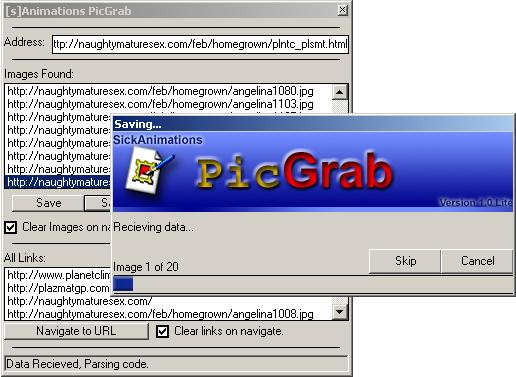



## PicGrab 1\.0 \- Download all linked images off a web page\!

### Description

This program uses MSINET (next version uses winsock ocx) to get the source for a webpage, and parses the code for links, and puts all the image links in a list. You can download files individually, or save them all at once using a unique (fully customizable) naming system. I have got rid of most bugs. The GUI is very neat and SEXY :P.

Features in next version:

-Batch Downloads

-Recurse HTML links (set depth)

-Winsock Transfers

-Help

Enjoy my first Full Release Program i have submitted to PSC. Remember, vote if it is worthy of a vote.
 
### More Info
 
URL - What URL to get the webpage.

Images.

404 Errors are saved in Image Files.

             |
---                |---
**Submitted On**   |2003-03-13 18:42:22
**By**             |[SickAnimations](https://github.com/Planet-Source-Code/PSCIndex/blob/master/ByAuthor/sickanimations.md)
**Level**          |Advanced
**User Rating**    |4.4 (22 globes from 5 users)
**Compatibility**  |VB 6\.0
**Category**       |[Internet/ HTML](https://github.com/Planet-Source-Code/PSCIndex/blob/master/ByCategory/internet-html__1-34.md)
**World**          |[Visual Basic](https://github.com/Planet-Source-Code/PSCIndex/blob/master/ByWorld/visual-basic.md)
**Archive File**   |[PicGrab\_1\_1558693132003\.zip](https://github.com/Planet-Source-Code/sickanimations-picgrab-1-0-download-all-linked-images-off-a-web-page__1-43974/archive/master.zip)

